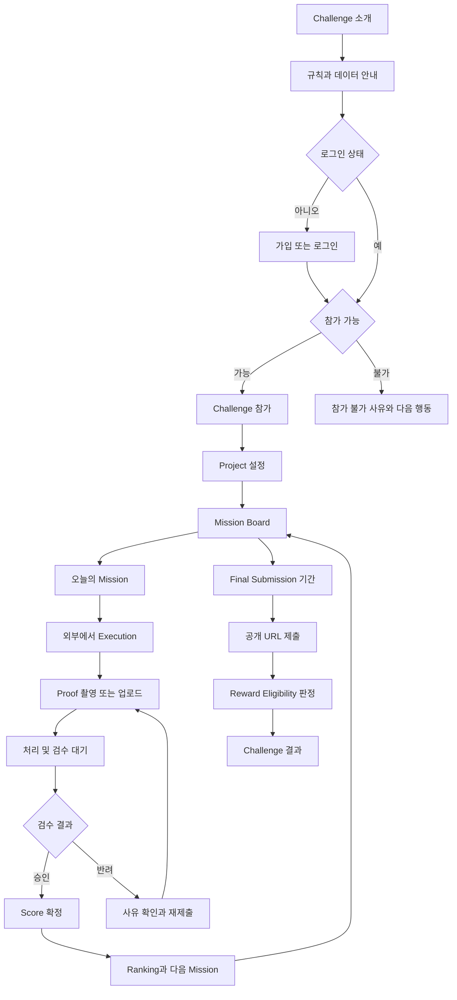
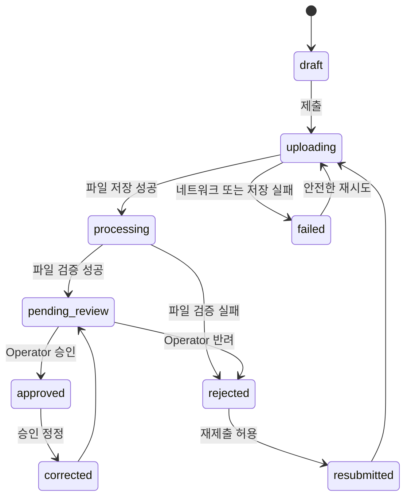

# PROOVIT Launch MVP User Flows

- 문서 상태: Draft
- 최종 수정일: 2026-09-12
- 관련 문서: [PRD](PRD.md), [용어집](GLOSSARY.md), [결정 목록](../sprint-0/DECISION_REGISTER.md)

이 문서는 화면 디자인보다 먼저 사용자 행동, 시스템 판정, 오류와 복구 상태를 정의한다. 정책이 미승인인 분기는 `결정 필요`로 표시한다.

## 1. 전체 흐름



## 2. Flow A Challenge 확인과 참가

### 시작 조건

- 사용자가 Challenge 링크 또는 서비스 홈에 접근한다.

### 정상 흐름

1. 시스템은 Challenge 이름, 목표, 기간, 시간대와 참가 상태를 표시한다.
2. 사용자는 Mission, Proof, Score, Ranking과 Reward Eligibility 규칙을 확인한다.
3. 시스템은 수집 정보, Proof 공개 범위와 실제 금전 지급 여부를 명확히 표시한다.
4. 사용자는 참가 CTA를 선택한다.
5. 로그인하지 않았다면 가입 또는 로그인한다.
6. 시스템은 참가 가능 여부를 서버에서 확인한다.
7. 사용자는 필수 동의 내용을 확인하고 참가한다.
8. 시스템은 Participation을 한 번만 생성하고 Project 설정으로 이동한다.

### 예외와 복구

- 참가 기간 종료: 참가 불가 사유와 다음 Challenge 안내를 표시한다.
- 이미 참가함: 중복 생성 없이 기존 진행 화면으로 이동한다.
- 요청 중복 또는 재시도: 같은 User와 Challenge에 Participation을 하나만 유지한다.
- 네트워크 실패: 사용자가 입력과 동의 상태를 확인한 뒤 다시 시도할 수 있다.
- 계정 제한: 내부 보안 정보를 노출하지 않고 지원 경로를 안내한다.

### 결정 필요

- 시작일 이후 참가 허용 여부
- 필수 동의 항목과 연령 또는 지역 제한
- 닉네임과 프로필 공개 범위

## 3. Flow B Project 설정

### 정상 흐름

1. 사용자는 Project Name, Target Customer, Current Stage와 Available Time per Day를 입력한다.
2. 선택 가능한 경우 Project Icon을 고른다.
3. 시스템은 필수값, 길이와 허용 값을 검증한다.
4. 저장 성공 후 입력 내용을 다시 표시한다.
5. 사용자는 Mission Board로 이동한다.

### 예외와 복구

- 입력 오류: 오류가 있는 필드와 해결 방법을 함께 표시한다.
- 저장 실패: 입력값을 유지하고 재시도할 수 있다.
- 새로고침 또는 이탈: 저장되지 않은 변경이 있다면 경고한다.
- 중복 저장: 하나의 활성 Project만 유지한다.

### 결정 필요

- 필수 필드와 글자 수
- Project 수정 가능 기간과 횟수
- Pivot이 과거 Mission Context와 Final Submission에 미치는 영향

## 4. Flow C Mission Board와 Daily Mission

### 정상 흐름

1. 시스템은 Participant의 Challenge와 Project를 확인한다.
2. Board는 Day 1부터 Day 31, Phase와 각 Mission 상태를 표시한다.
3. 사용자는 현재 수행 가능한 Mission을 선택한다.
4. Mission Detail은 목적, 가이드, 완료 기준, Proof 예시, 허용 형식, 기한과 획득 가능 Score를 표시한다.
5. 사용자는 앱 밖에서 Execution을 수행한다.

### Mission 표시 상태

- locked: 아직 수행할 수 없음
- available: 현재 제출 가능
- pending_review: Proof 검수 대기
- approved: Proof 승인과 Score 확정
- rejected: 반려 사유 확인 및 재제출 가능
- missed: 미제출 또는 정책상 제출 종료
- completed_without_score: 운영 정정 등 예외 상태가 필요할 때만 사용하며 별도 승인 필요

### 예외와 복구

- Board 로딩 실패: 기존 데이터를 완료 상태로 오인하지 않고 재시도한다.
- 기기 시간이 서버와 다름: 서버의 Challenge 시간과 기한을 기준으로 표시한다.
- 잠긴 Mission URL 직접 접근: 서버가 제출 권한을 거부하고 허용 화면으로 안내한다.
- Mission 콘텐츠 변경: 진행 중 사용자에게 적용되는 콘텐츠 버전을 유지한다.

## 5. Flow D Proof 제출

### 정상 흐름

1. 사용자는 Mission Detail에서 Proof 제출을 시작한다.
2. 시스템은 허용된 촬영 또는 파일 선택 방법을 표시한다.
3. 사용자는 이미지를 촬영하거나 선택한다.
4. 클라이언트는 미리보기, 삭제와 다시 선택을 제공한다.
5. 서버는 인증, Mission 제출 가능 여부와 파일 제한을 확인한다.
6. 파일 저장에 성공하면 Proof 메타데이터를 기록한다.
7. 시스템은 제출 시각과 `pending_review` 상태를 반환한다.
8. 사용자는 검수 대기 상태와 예상 Score가 있는 경우 확정 전 값임을 확인한다.

### Proof 상태



### 예외와 복구

- 카메라 권한 거부: 정책상 허용된 대체 입력 또는 권한 설정 안내를 제공한다.
- 지원하지 않는 파일: 허용 형식과 크기를 알려주고 업로드하지 않는다.
- 파일 저장 성공 후 DB 저장 실패: 파일을 정리하거나 재처리 가능한 상태로 기록한다.
- 재시도 응답 유실: idempotency key로 동일 Proof를 반환한다.
- 중복 탭 제출: 하나의 유효 제출만 생성한다.
- 기한 경계 제출: 서버가 기록한 수신 시각과 정책으로 판정한다.
- 악성 또는 처리 불가 파일: 공개하지 않고 안전하게 격리 또는 삭제한다.

## 6. Flow E Proof 검수

### Operator 정상 흐름

1. Operator는 `pending_review` 목록을 연다.
2. 시스템은 Proof, Mission 완료 기준, 제출 시각과 과거 검수 이력을 표시한다.
3. Operator는 승인 또는 반려를 선택한다.
4. 반려에는 사용자에게 보여줄 사유를 입력한다.
5. 서버는 현재 상태와 Operator 권한을 다시 확인한다.
6. 승인 시 Proof 상태와 Score Event를 원자적으로 확정한다.
7. 시스템은 Participant에게 최신 상태를 표시한다.

### 예외와 복구

- 두 Operator가 동시에 처리: 먼저 확정된 상태만 유효하며 다른 요청은 최신 상태를 반환한다.
- 승인 후 처리 응답 유실: 재시도해도 Score Event를 중복 생성하지 않는다.
- 잘못된 승인: 이력을 삭제하지 않고 정정과 보정 Score Event를 생성한다.
- 파일 접근 실패: 검수하지 않고 운영 오류로 기록한다.
- 권한 없음: 목록, 파일과 처리 API 모두 접근을 거부한다.

## 7. Flow F Score와 Ranking

### 정상 흐름

1. Proof 승인 사건이 Score 계산을 요청한다.
2. 서버는 Mission 정책 버전, baseScore, Deadline과 최초 유효 제출 시각을 읽는다.
3. 서버는 승인된 multiplier로 finalScore를 계산한다.
4. 서버는 중복 불가능한 Score Event를 저장한다.
5. Ranking은 확정 Score 집계로 갱신된다.
6. 사용자는 Score 결과, 누적 Score와 Rank Change를 확인한다.

### 예외와 복구

- Score 저장 실패: Proof 승인과의 원자성 또는 재처리 전략으로 불일치를 복구한다.
- Ranking 갱신 지연: Score 확정과 Ranking 반영 상태를 구분한다.
- 동점: 승인된 tie-breaker 규칙을 적용한다.
- 참가자 한 명: Rival 영역을 숨기고 빈 공간을 잘못된 사용자로 채우지 않는다.
- Score 정정: 원본 Event를 수정하지 않고 보정 Event를 추가한다.

## 8. Flow G Final Submission과 완료

### 정상 흐름

1. 시스템은 Final Submission 가능 기간을 표시한다.
2. 사용자는 Public URL, One-line Description, Target Customer와 Launch Screenshot을 입력한다.
3. 서버는 입력 형식과 제출 권한을 확인한다.
4. 시스템은 제출 결과와 수정 가능 여부를 보여준다.
5. 서버는 승인된 Score Rate와 Final Submission 상태로 Reward Eligibility를 계산한다.
6. 사용자는 충족 조건과 부족한 조건을 구분해 확인한다.

### 예외와 복구

- 잘못된 URL: 입력 위치에서 수정 방법을 안내한다.
- 내부망 또는 위험한 URL: 서버가 무분별하게 접속하지 않으며 승인된 검증만 수행한다.
- 제출 마감 경계: 서버 수신 시각을 기준으로 처리한다.
- 저장 실패: 작성 내용을 보존하고 재시도한다.
- Score 검수 미완료: 자격 결과를 확정하지 않고 판정 대기 사유를 표시한다.
- 제출 정정: 이력과 자격 재계산 근거를 남긴다.

## 9. Flow H 계정 및 데이터 삭제

### 정상 흐름

1. 사용자는 계정 설정에서 수집 정보와 삭제 요청 경로를 확인한다.
2. 시스템은 재인증이 필요한 경우 안전하게 요청한다.
3. 사용자는 삭제 범위와 보존 예외를 확인한다.
4. 시스템은 요청을 기록하고 처리 상태를 제공한다.
5. DB, 파일 저장소와 외부 처리자의 삭제 결과를 확인한다.

### 예외와 복구

- 파일 삭제 실패: 완료로 표시하지 않고 재처리한다.
- 법적 또는 분쟁 보존: 근거, 범위와 기간을 사용자에게 설명한다.
- 삭제 중 재로그인 또는 새 요청: 계정 상태 정책에 따라 차단하거나 취소 절차를 제공한다.

## 10. 와이어프레임 대상

다음 화면은 정상 상태뿐 아니라 괄호 안의 상태를 함께 그린다.

1. Challenge Landing (참가 가능, 마감, 이미 참가)
2. Login and Account Recovery (오류, 만료)
3. Project Setup (초기, 유효성 오류, 저장 실패)
4. Mission Board (로딩, 정상, 빈 상태, 오류)
5. Daily Mission (잠금, 제출 가능, 마감)
6. Proof Capture and Upload (권한 거부, 처리 중, 실패)
7. Proof Status (검수 대기, 승인, 반려, 재제출)
8. Score Result (확정, 정정, Ranking 반영 대기)
9. Ranking (정상, 동점, Rival 없음)
10. Final Submission (입력 오류, 저장 실패, 완료)
11. Reward Eligibility (충족, 미충족, 판정 대기)
12. Account and Data Request
13. Operator Proof Queue
14. Operator Proof Review and Correction

## 11. Vertical Slice 후보

첫 Vertical Slice는 다음 한 흐름만 실제 데이터로 연결한다.

```text
로그인한 Participant
→ Project 설정
→ 하나의 Daily Mission 확인
→ 하나의 이미지 Proof 제출
→ Operator 승인
→ Score Event 한 번 생성
→ Participant가 확정 Score 확인
```

Ranking, 31일 Board, Reward Eligibility와 Fruvi는 이 Slice의 후속 기능이다. 다만 Vertical Slice 설계가 이후 기능을 막지 않도록 Challenge, Participation, Mission, Proof와 Score의 책임 경계를 먼저 합의한다.
